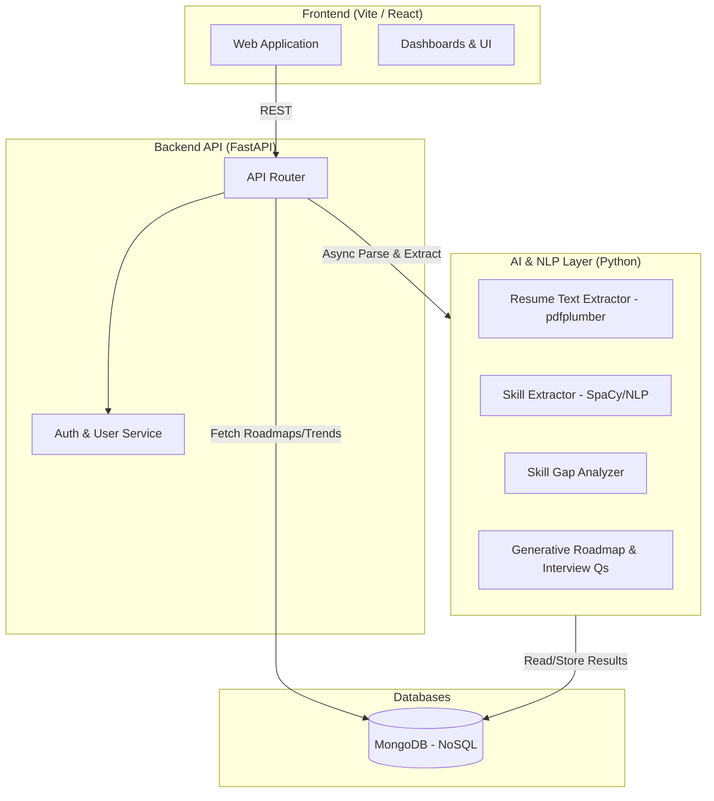

# AI Skill Gap Analyzer & Career Roadmap Platform
**Tagline:** "Google Maps for Career Development"

## 1. Complete System Architecture Diagram

The system follows a modular, production-ready microservices architecture.
It separates the frontend UI layer from the heavy NLP/AI backend, using a scalable async web framework (FastAPI) and document storage (MongoDB).



## 2. Database Schema (MongoDB)

Using **MongoDB** via `motor` for flexible NoSQL document storage of resumes, analysis results, and generated roadmaps.

### Collections:

1. **Users**
   - `_id`: ObjectId
   - `email`: String (Unique)
   - `hashed_password`: String
   - `created_at`: DateTime

2. **JobDescriptions** (For Market Trends & Job Data)
   - `_id`: ObjectId
   - `role_title`: String
   - `required_skills`: List[String]
   - `preferred_skills`: List[String]
   - `experience_level`: String
   - `category`: String

3. **Resumes**
   - `_id`: ObjectId
   - `user_id`: String
   - `parsed_text`: String
   - `extracted_skills`: List[String]
   - `uploaded_at`: DateTime

4. **Analyses** (Skill Gap & Readiness)
   - `_id`: ObjectId
   - `user_id`: String
   - `resume_id`: String
   - `target_role`: String
   - `readiness_score`: Float
   - `missing_skills`: List[String]
   - `identified_skills`: List[String]
   - `roadmap`: List[Object]
   - `interview_questions`: List[String]
   - `created_at`: DateTime

## 3. Backend API Structure

**Framework:** Python FastAPI
**Database Driver:** `motor` (Async MongoDB)

**Core Endpoints:**
- `GET /api/health` - Health check.
- `POST /api/analyze/resume` - Accepts `role` (optional) and `resume` (PDF/DOCX). Handles extraction and skill gap analysis.
- `GET /api/dashboard/trends` - Fetches global skill demand and trends.
- `GET /api/analysis/{analysis_id}` - Fetches a generated skill gap report and roadmap.

## 4. AI / NLP Pipeline

Built natively in **Python**:

1. **Document Parsing:** Use `pdfplumber` for robust PDF text extraction.
2. **Skill Extraction (NER):** Use `SpaCy` (`en_core_web_sm`) and pattern matching to identify programming languages, frameworks, and tools.
3. **Skill Matching & Gap Analysis:** Compare extracted skills against a target role's required skills (from `JobDescriptions` collection or internal constants).
4. **Scoring Engine:** Calculates a Match % based on the ratio of successfully matched required skills.
5. **Generative Processing:** Generates a structured Weekly roadmap focusing specifically on the **Missing Skills**, and generates technical Interview Questions targeted at evaluating knowledge of those missing skills.

## 5. Frontend UI Structure

Built using React (Vite) + Tailwind CSS + Recharts.

* **`/` (Home):** Hero banner, value proposition.
* **`/analyzer`:** Main feature. Drag-and-drop resume upload, role selection dropdown ("Auto-Detect" or choose specific role).
* **`/dashboard`:** 
  - **Readiness Score:** Circular progress bar.
  - **Skill Gap Report:** Identified vs Missing Skills display.
  - **Market Trends:** Recharts bar charts showing trending technologies.
* **`/roadmap`:** A vertical timeline component showcasing the generated Week 1-10 learning steps.
* **`/interview-prep`:** List of AI-generated technical interview questions based on the candidate's weak points.

## 6. Folder Structure

```
AI-Skills-Gap-Analyzer/
├── backend/                  # FastAPI Application
│   ├── main.py               # API Entrypoint
│   ├── database.py           # MongoDB Connection setup (Motor)
│   ├── nlp/
│   │   ├── engine.py         # AI Pipeline (Parsing, Gap Analysis, Roadmap Gen)
│   ├── models/               # Pydantic Schemas
│   ├── requirements.txt      # Python dependencies
├── frontend/                 # React UI
│   ├── src/
│   │   ├── components/       # Reusable UI elements
│   │   ├── pages/            # Analyzer, Dashboard, Roadmap views
│   │   ├── App.jsx           # React Router setup
│   ├── package.json          # Node dependencies
├── System_Architecture.md    # This documentation file
```

## 7. Example Code Snippets

**FastAPI MongoDB Connection (`database.py`):**
```python
from motor.motor_asyncio import AsyncIOMotorClient
import os

MONGO_URL = os.getenv("MONGO_URL", "mongodb://localhost:27017")
client = AsyncIOMotorClient(MONGO_URL)
db = client.ai_skills_gap

async def get_db():
    return db
```

**Skill Gap Calculation Logic (`nlp/engine.py`):**
```python
def calculate_readiness_score(resume_skills, target_skills):
    if not target_skills:
        return 0
    resume_skills_set = set([s.lower() for s in resume_skills])
    target_skills_set = set([s.lower() for s in target_skills])
    
    match_count = sum(1 for skill in target_skills_set if skill in resume_skills_set)
    return round((match_count / len(target_skills_set)) * 100)
```

## 8. Deployment Strategy (Docker + Cloud)

* **Backend API:** Containerized via **Docker** (`Dockerfile`). Deployed to a service like **Render**, **AWS ECS (Fargate)**, or **DigitalOcean App Platform**.
* **Frontend:** Deployed via **Vercel** or **Netlify** for CDN-backed automatic builds.
* **Database:** **MongoDB Atlas** for a scalable, fully-managed, cloud-native database.
* **Storage (Future):** AWS S3 bucket for long-term secure resume storage if user accounts are implemented.

**Sample Dockerfile (Backend):**
```dockerfile
FROM python:3.10-slim

WORKDIR /app

COPY requirements.txt .
RUN pip install --no-cache-dir -r requirements.txt
RUN python -m spacy download en_core_web_sm

COPY . .

CMD ["uvicorn", "main:app", "--host", "0.0.0.0", "--port", "8000"]
```
