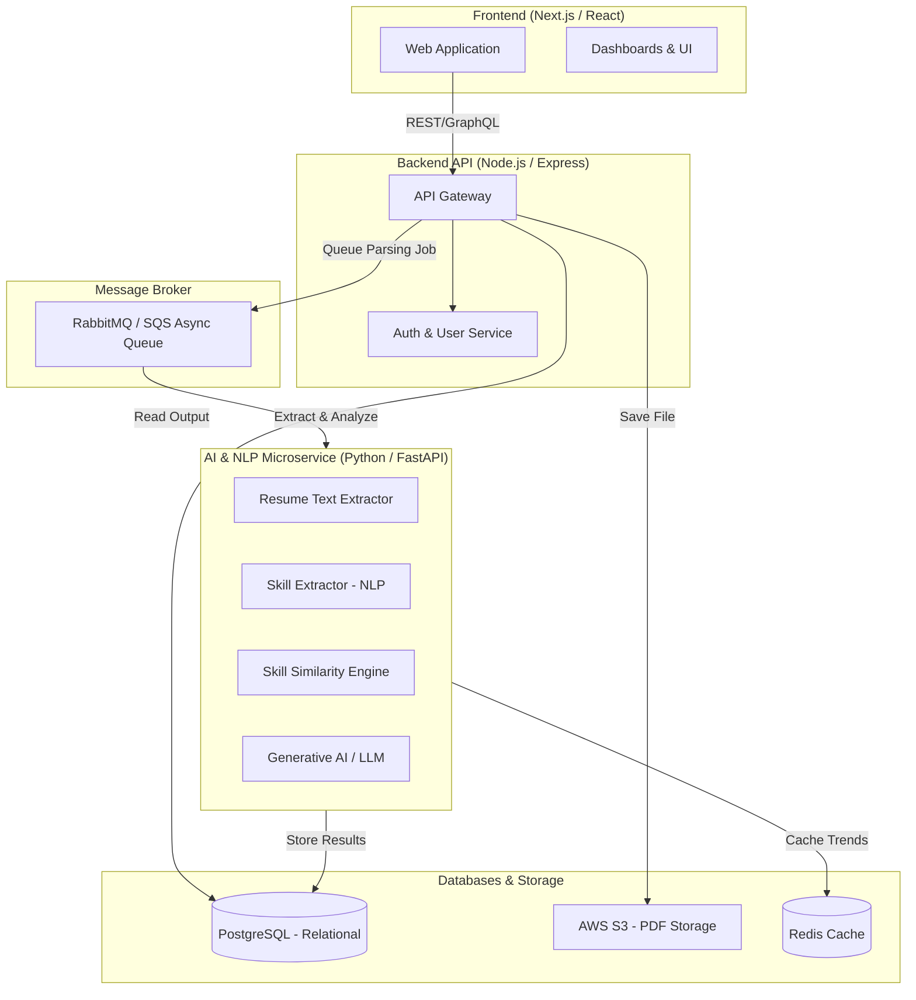
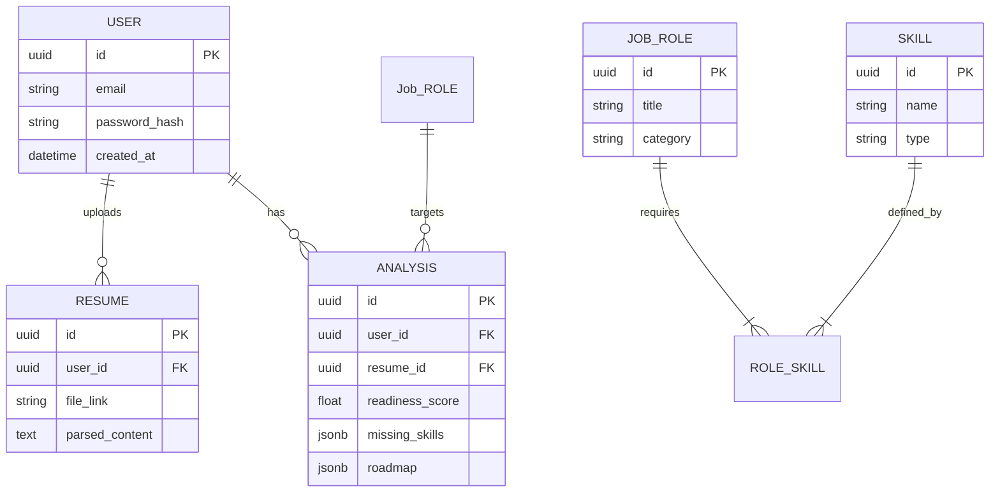

# System Design: AI Skill Gap Analyzer & Career Roadmap Platform
**Tagline:** "Google Maps for Career Development"

## 1. Complete System Architecture Diagram

The system follows a modern microservices architecture perfectly suited for both a production startup and a massive university project.



## 2. Database Schema

Using **PostgreSQL** for relational mapping between Users, Resumes, Roles, and Analysis results.



## 3. Backend API Structure

**Framework:** Node.js with Express & Python FastAPI
**Authentication:** JWT (JSON Web Tokens)

**Core Endpoints:**
- `POST /api/v1/auth/register` & `/login` - User Authentication
- `POST /api/v1/resume/upload` - Multipart form-data for resume upload. Returns a Job ID for async tracking.
- `GET /api/v1/roles` - Fetches canonical job roles (e.g., Data Scientist).
- `GET /api/v1/analysis/{job_id}` - Polling endpoint or WebSocket for async NLP results.
- `GET /api/v1/roadmap/{user_id}` - Retrieves the generated weekly roadmap.
- `GET /api/v1/market/trends` - Scraped industry trends (served via Redis cache to lower latency).

## 4. AI / NLP Pipeline

The core engine is built in **Python** using cutting-edge ML techniques:

1. **Document Parsing:** `pdfminer.six` or `PyMuPDF` parses raw text from the uploaded file.
2. **Text Preprocessing & PII Masking:** Removes sensitive data (phone, email) using regex and standardizes text.
3. **Skill Extraction (NER):** Uses a fine-tuned `SpaCy` model (or `RoBERTa` via Hugging Face) specifically trained on resume datasets to identify entities like `SKILL`, `TOOL`, `FRAMEWORK`.
4. **Skill Matching & Gap Analysis:** Extracted skills are turned into embeddings using `SentenceTransformers`. Cosine similarity is used to match them against the required skills of the target Job Role, catching aliases (e.g., "React.js" matches "React").
5. **Generative Recommendations:** An LLM (OpenAI API or Local LLaMA for cost-saving) receives the missing skills and prompts: *"Generate a 8-week learning roadmap and 5 interview questions targeting these missing skills: [List]"*.

## 5. Frontend UI Structure

Built efficiently utilizing **Next.js** and **Tailwind CSS**.

* **`/` (Landing Page):** Hero section, value proposition, "Get Started" CTA.
* **`/upload`:** Drag-and-drop resume upload zone with role selector dropdown/input field.
* **`/dashboard`:** 
  - **Job Readiness Score Card:** Circular progress chart (e.g., 64%).
  - **Skill Gap Report:** Radar charts comparing User Skills vs Required Skills.
* **`/roadmap`:** A vertical timeline UI component depicting Week 1-8 plans and resource links.
* **`/interview-prep`:** Flashcard interface for technical questions based on missing skills.
* **`/market-demand`:** Recharts/Chart.js integration displaying trending skills.

## 6. Sample Code Snippets

**Python (FastAPI) - Skill Extraction Endpoint:**
```python
import spacy
from fastapi import FastAPI
from pydantic import BaseModel

app = FastAPI()
nlp = spacy.load("en_core_web_sm") # Replace with fine-tuned Skill NER model

class Document(BaseModel):
    text: str

@app.post("/api/ai/extract")
def extract_skills(doc: Document):
    parsed = nlp(doc.text)
    # Filter entities recognized as skills
    skills = [ent.text for ent in parsed.ents if ent.label_ == "SKILL"]
    return {"skills_detected": list(set(skills))}
```

**React (Next.js) - Drag and Drop Uploader:**
```jsx
import React, { useCallback } from 'react';
import { useDropzone } from 'react-dropzone';

export default function ResumeUpload({ targetRole }) {
  const onDrop = useCallback(async (acceptedFiles) => {
    const formData = new FormData();
    formData.append('resume', acceptedFiles[0]);
    formData.append('role', targetRole);
    
    await fetch('/api/v1/resume/upload', {
      method: 'POST',
      body: formData,
    });
    // Trigger polling or state update
  }, [targetRole]);

  const { getRootProps, getInputProps } = useDropzone({ accept: '.pdf,.doc,.docx' });

  return (
    <div {...getRootProps()} className="border-4 border-dashed border-blue-400 p-12 text-center rounded-lg cursor-pointer hover:bg-zinc-50 transition">
      <input {...getInputProps()} />
      <p className="text-lg font-semibold text-gray-600">Drag & Drop Resume, or Click to Select</p>
    </div>
  );
}
```

## 7. Deployment Plan

* **Frontend:** Deployed to **Vercel** for automatic CI/CD and edge caching.
* **Backend API (Node.js):** Deployed on **AWS Elastic Beanstalk** or **Render**.
* **AI Engine (Python):** Containerized via **Docker** and deployed on **AWS ECS (Fargate)** to handle CPU-heavy NLP tasks without managing underlying servers.
* **Database:** **Supabase** (Managed PostgreSQL) or **AWS RDS**.
* **Storage:** **AWS S3** bucket (private, encrypted) for resuming files.

## 8. Scalability Considerations

* **Asynchronous Processing:** NLP is slow. Uploads should be queued using **RabbitMQ** or **Celery**. The API returns immediately, and the frontend polls for completion status.
* **Microservices:** Separating I/O heavy operations (Node.js) from CPU heavy operations (Python ML) allows scaling the AI engine instances independently during high traffic.
* **Caching:** Heavy DB queries (Market Demands, default Job Roles required skills) are cached in **Redis** with hourly TTLs.

## 9. Security Considerations

* **PII Sanitization:** The AI pipeline must strip Personally Identifiable Information (Names, Phone numbers, Emails) *before* saving to the database to ensure GDPR compliance.
* **Malicious Files:** Uploads must be strictly validated (mime-type checking, size limits < 5MB).
* **Rate Limiting:** Protect endpoints against DDoS or API abuse (e.g., maximum 5 resume analyses per hour per IP).
* **Signed URLs:** S3 files are accessed via short-lived pre-signed URLs, preventing public exposure of resumes.

## 10. Future Improvements

* **AI Voice Interrogation:** Implement WebRTC and Speech-To-Text for an interactive, conversational Mock Interview bot (using GPT-4 Realtime).
* **LinkedIn/GitHub Integrations:** Pulling live data from profiles to enhance the resume directly.
* **Course Affiliations:** Monetize the platform by integrating Udemy, Coursera, or edX affiliate APIs in the learning roadmap.
* **Resume Tailoring Tool:** Generative AI tool to automatically rewrite users' bullet points to better match the target job description.
